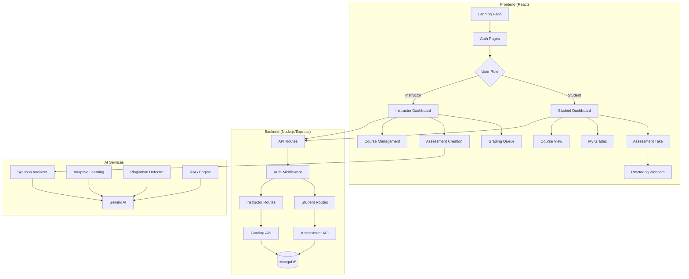
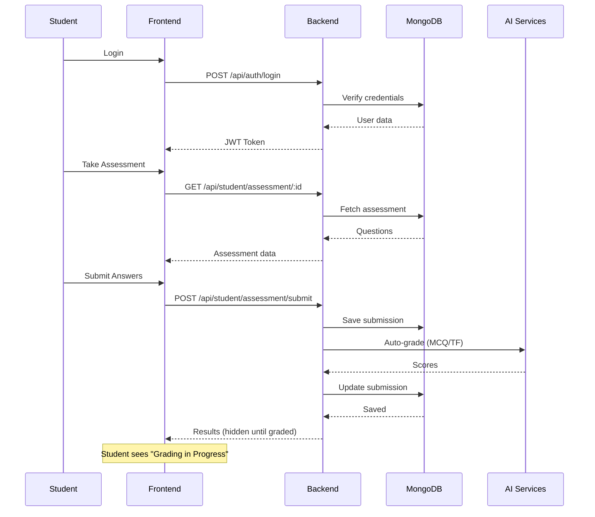

# Navigate.io

A full-stack AI-Enhanced Assessment Platform for secure online learning. This LMS provides instructors with advanced grading tools and gives students a secure, proctored exam environment with detailed performance insights.

## Features

### For Instructors
- **Assessment Creation** - Create quizzes with MCQ, True/False, Short Answer questions
- **AI Question Generation** - Generate questions from syllabus using Gemini AI
- **Grading Queue** - Review submissions with manual scoring per question
- **Course Management** - Upload PDFs and course materials
- **Analytics Dashboard** - Track student progress and submission statistics

### For Students
- **Secure Proctoring** - AI-powered webcam monitoring during exams
- **Assessment Taking** - Full-screen exam environment with timer
- **Grades Dashboard** - View detailed results after instructor review
- **Course Materials** - Access uploaded learning resources

### Technical Highlights
- **JWT Authentication** with role-based access (Student/Instructor)
- **MongoDB** database with Mongoose ODM
- **React** frontend with Material-UI components
- **Dark Mode** support throughout the application
- **Gemini AI** integration for question generation

---

## Architecture



---

## Project Structure

```
Navigate-Team-13/
├── frontend/                    # React Frontend Application
│   ├── src/
│   │   ├── components/
│   │   │   ├── auth/            # Login, Register components
│   │   │   ├── instructor/      # GradingQueue, SyllabusUpload
│   │   │   ├── student/         # ProctoringWebcam, AssessmentCard
│   │   │   └── layout/          # Sidebar, Header, Navigation
│   │   ├── pages/
│   │   │   ├── auth/            # Login, Register pages
│   │   │   ├── instructor/      # Dashboard, AssessmentCreation
│   │   │   └── student/         # Dashboard, AssessmentTake, MyGrades
│   │   ├── contexts/            # AuthContext, ThemeContext
│   │   ├── services/            # API service functions
│   │   └── App.js               # Main routing component
│   └── package.json
│
├── backend/                     # Node.js/Express Backend
│   ├── api/
│   │   ├── auth.js              # Authentication routes
│   │   ├── assessment.js        # Assessment CRUD routes
│   │   ├── student-assessment-routes.js
│   │   └── instructor-assessment-routes.js
│   ├── models/
│   │   ├── User.js              # User schema (Student/Instructor)
│   │   ├── Course.js            # Course schema with materials
│   │   ├── Assessment.js        # Assessment with questions
│   │   ├── Submission.js        # Student submission answers
│   │   └── LearningPath.js      # Adaptive learning paths
│   ├── middlewares/
│   │   └── auth.js              # JWT verification middleware
│   ├── services/
│   │   ├── curriculumService.js # AI curriculum generation
│   │   └── adaptiveLearningService.js
│   ├── server.js                # Express server entry point
│   └── package.json
│
├── ai_services/                 # AI/ML Microservices
│   ├── assessment/
│   │   └── syllabusAnalyzer.js  # Parse syllabus, generate questions
│   ├── adaptive_learning/
│   │   └── adaptiveLearningEngine.js
│   ├── plagiarism/
│   │   └── plagiarismDetector.js
│   ├── rag/
│   │   └── embeddings.js        # Document embeddings for RAG
│   ├── expert_panel/
│   │   └── expertPanel.js       # AI expert consultation
│   └── models/
│       └── transformersModel.js # Gemini API wrapper
│
├── .gitignore
├── start_app.bat                # Windows startup script
└── README.md
```

---

## Data Flow



---

## Installation

### Prerequisites
- Node.js v18+
- MongoDB (local or Atlas)
- Gemini API Key (for AI features)

### Setup

1. **Clone the repository**
   ```bash
   git clone https://github.com/PranavKKK2311/Navigate.io.git
   cd Navigate.io
   ```

2. **Backend Setup**
   ```bash
   cd backend
   npm install
   ```
   Create `.env` file:
   ```
   MONGO_URI=mongodb://localhost:27017/navigate
   JWT_SECRET=your-secret-key
   GEMINI_API_KEY=your-gemini-api-key
   ```

3. **Frontend Setup**
   ```bash
   cd frontend
   npm install
   ```

4. **AI Services Setup**
   ```bash
   cd ai_services
   npm install
   ```
   Create `.env` file:
   ```
   GEMINI_API_KEY=your-gemini-api-key
   GEMINI_MODEL=gemini-2.0-flash
   ```

5. **Start the Application**
   ```bash
   # Terminal 1 - Backend
   cd backend && npm start

   # Terminal 2 - Frontend
   cd frontend && npm start
   ```

   Or use the Windows batch file:
   ```bash
   start_app.bat
   ```

---

## API Endpoints

### Authentication
| Method | Endpoint | Description |
|--------|----------|-------------|
| POST | `/api/auth/register` | Register new user |
| POST | `/api/auth/login` | Login and get JWT |
| GET | `/api/auth/me` | Get current user |

### Student Routes
| Method | Endpoint | Description |
|--------|----------|-------------|
| GET | `/api/student/assessment/available` | List available assessments |
| GET | `/api/student/assessment/:id` | Get assessment for taking |
| POST | `/api/student/assessment/submit` | Submit answers |
| GET | `/api/student/assessment/my-grades` | Get all grades |

### Instructor Routes
| Method | Endpoint | Description |
|--------|----------|-------------|
| POST | `/api/instructor/assessment/save` | Create/update assessment |
| GET | `/api/instructor/assessment/submissions` | Get pending submissions |
| PUT | `/api/instructor/assessment/submissions/:id/grade` | Grade a submission |

---

## Tech Stack

| Layer | Technology |
|-------|------------|
| Frontend | React, Material-UI, Axios |
| Backend | Node.js, Express, Mongoose |
| Database | MongoDB |
| Auth | JWT, bcrypt |
| AI | Google Gemini API |
| Proctoring | Browser MediaDevices API |

---

## Screenshots

Add screenshots of:
- Student Dashboard
- Assessment Taking (with proctoring webcam)
- Grading Queue
- Detailed Results View

---

## Contributing

1. Fork the repository
2. Create a feature branch (`git checkout -b feature/new-feature`)
3. Commit changes (`git commit -m "Add new feature"`)
4. Push to branch (`git push origin feature/new-feature`)
5. Open a Pull Request

---

## License

MIT License - See [LICENSE](LICENSE) for details.

---

## Authors

- **Pranav K** - [GitHub](https://github.com/PranavKKK2311)
